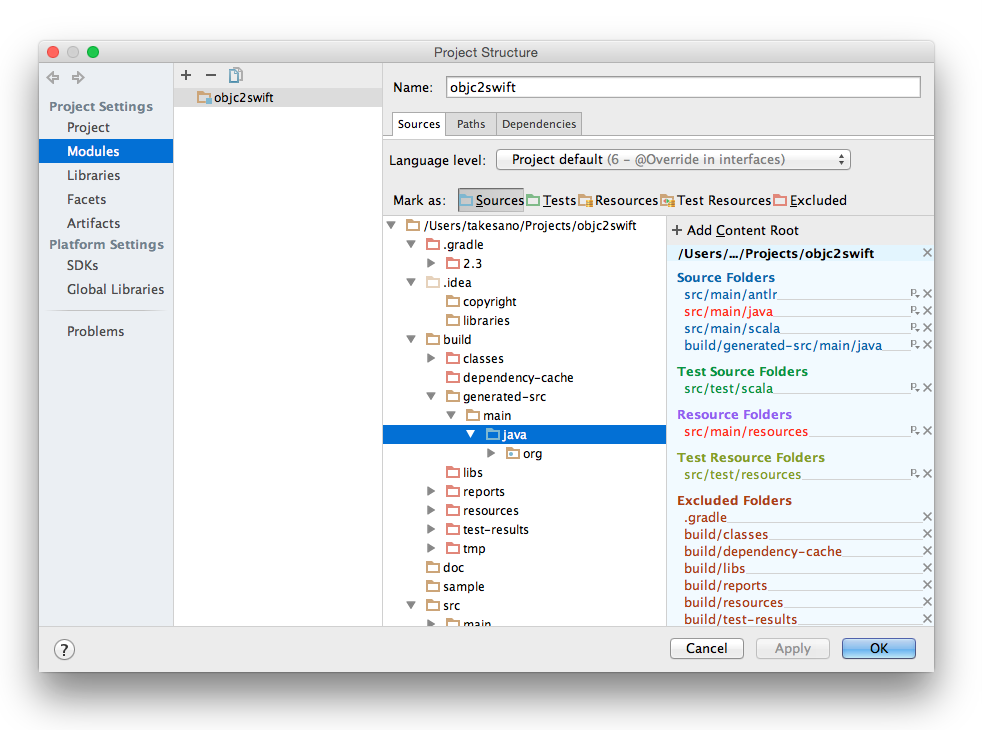
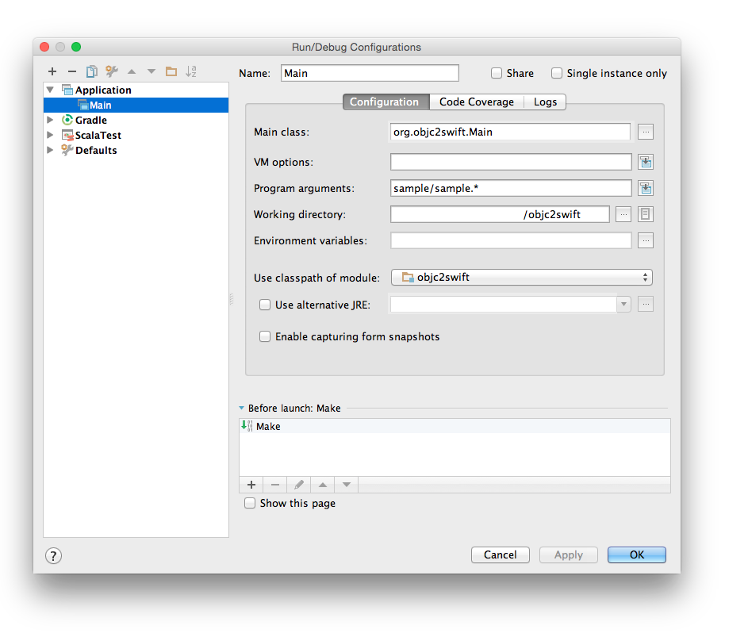

# objc2swift

*objc2swift* is an experimental project aiming to create an **Objective-C -> Swift** converter (or at least something that would help a human being convert codes by hand). 

The program is written in Scala, and is based on [ANTLR](http://www.antlr.org) the magnificent parser generator.

## Quick Start

Build the project, run the jar with Obj-C source files in the sample dir.

```
$ gradle build
$ java -jar build/libs/objc2swift-1.0.jar sample/sample.h sample/sample.m
```

The input files are Obj-C header and implementation files such as:

```
// sample/sample.h
@interface MyClass : NSObject <SomeProtocol>

- (void)doSomething;
- (NSString *)somethingWithArg1:(id)arg1 arg2:(int)arg2;

@end
```

```
// sample/sample.m
@implementation MyClass

- (void)doSomething
{
    [self somethingWithArg1:nil arg2:0];
}

- (NSString *)somethingWithArg1:(id)arg1 arg2:(int)arg2
{
    return @"something";
}

@end
```

They will be processed as a single input file, and you'll get the converted Swift class as below:

```
class MyClass : NSObject, SomeProtocol {
    func doSomething() {
        self.somethingWithArg1(nil, arg2: 0)
    }

    func somethingWithArg1(arg1:AnyObject, arg2 arg2:Int32) -> NSString {
        return "something"
    }
}
```

Great!


## Web-UI


Install typesafe activator and run on your localhost!

```
$ brew install typesafe-activator
$ cd web/
$ activator run
```

## Features
* `@interface Hoge ... @end` -> `class Hoge { ... }`
* ... more to come!

## Developer's Guide

### 1. Project Setup

Import Project from gradle build file.


Unmark build/ as 'Excluded', mark build/generated-src/main/java as 'Sources', and other directories under build/ as 'Excluded'.



Create new Run Configuration as below:



Run!

### 2. Project Structure

coming soon...

### 3. Printing the Parse Tree

With the `-t` option, the parse tree of the input source will be printed. You can use this to find the name and the containing text for each node.

```
$ java -jar build/libs/objc2swift-1.0.jar sample/sample.h -t
```

input:

```
@interface A : NSObject

@end
```

output:

```
1. translation_unit: '@interface' - '@end'
2.   external_declaration: '@interface' - '@end'
3.     class_interface: '@interface' - '@end'
4.       class_name: 'A'
4.       superclass_name: 'NSObject'
```

## LICENSE
This software is released under the MIT License, see [LICENSE.txt](LICENSE.txt).
