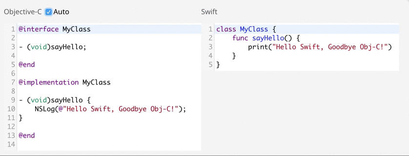

# objc2swift



Try the online version at [objc2swift.yahoo-labs.jp](http://objc2swift.yahoo-labs.jp) 

## Project Goal

We created _objc2swift_ for our own good, to reduce the redundant task when rewriting Obj-C code to Swift. 

Generally, rewriting process consists of two phases: first simply replacing the syntax from Obj-C to Swift, then adopting new features that are introduced to Swift.

_objc2swift_ is aimed at reducing the **first half** of the process, so that we can focus more on the creative / intellectual work. 

Please do not expect complete conversion. 

## Features

* Merges `@interface` and `@implementation` and create a single Swift `class`.
* Converts properties, including those that have it's own getter/setter in the implementation.
* Converts message-send to method-call.
* Converts init-process such as `[[MyThing alloc] initWithThing:...]` into `MyThing(thing: ...)`.
* Converts corresponding types and functions: `NSInteger` -> `Int`, `NSLog` -> `print`
* ...and more!

# Quick Start

## CLI

Build jar:

```sh
$ git clone https://github.com/yahoojapan/objc2swift.git
$ cd objc2swift
$ gradle jar
```

Create an alias, and pass the Obj-C source files you want to convert.

```sh
$ alias objc2swift='java -jar /path/to/objc2swift/build/libs/objc2swift-1.0.jar'
$ objc2swift src/test/resources/sample.*
```

## WEB-UI

Install [typesafe-activator](http://www.typesafe.com), and run.

```
$ brew install typesafe-activator
$ cd web/
$ activator run
```

Access `localhost:9000`, and there you are!

# Developer's Guide

_objc2swift_ is made with [ANTLR](http://www.antlr.org). More detail coming soon.

# LICENSE
This software is released under the MIT License, see [LICENSE.txt](LICENSE.txt).
